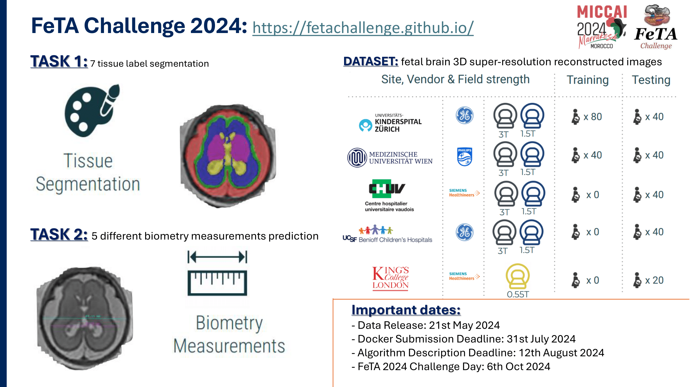

# FeTa_challenge_2024: Biometry Mesurements



## How to use

### Training

To train the model run:

```bash
python train.py --run_name MODEL_NAME [--gaussian_heads H] [--sigma SIGMA_1 ... SIGMA_H] [--learn_sigma] [--noise NOISE_LEVEL] [--noise_p P]
```

The algorithm presented to address the Fetal Tissue Annotation and Segmentation MICCAI 2024 Challenge: Biometry Task

### Testing

TO DO
```bash
python test.py --run_name MODEL_NAME
```
Different dataset

```bash
python test.py --run_name MODEL_NAME --dataset DATASET_NAME
```


DOI: TO DO 
PDF: TO DO 

Applications:
